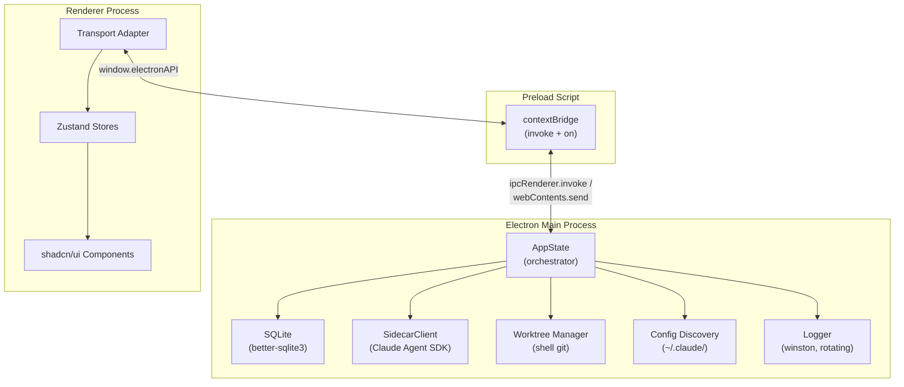
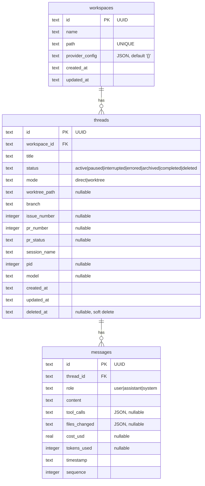
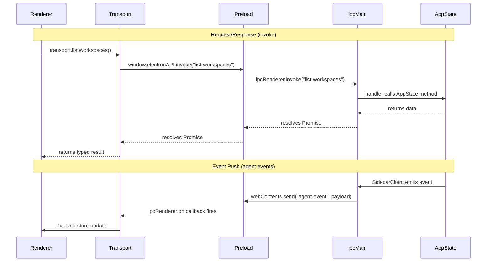
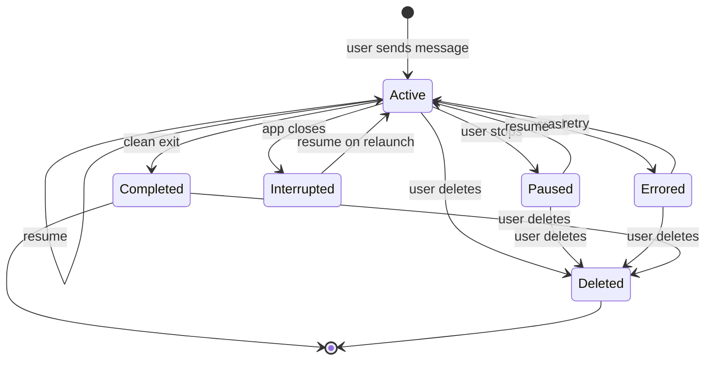
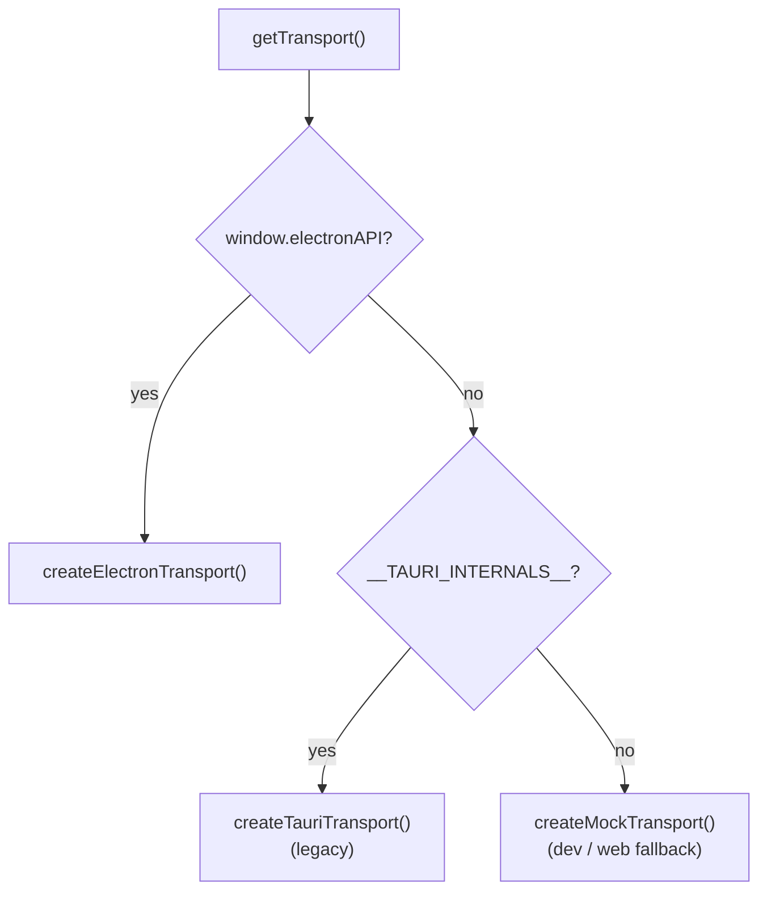
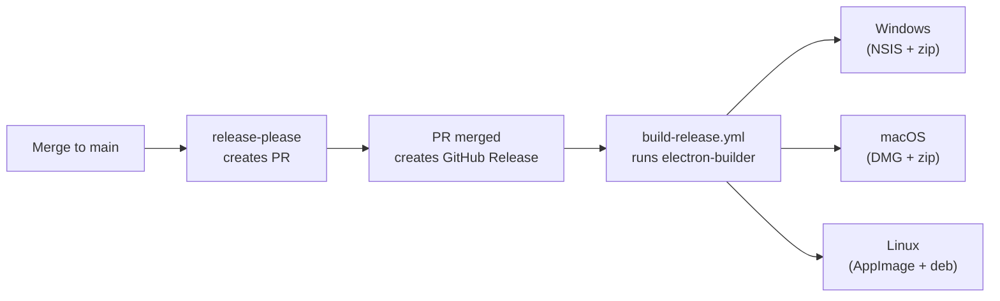

# Architecture

## 1. Overview

Mcode is a desktop app for orchestrating AI coding agents. It manages multiple Claude agent sessions across git repositories, inheriting configuration from the user's Claude Code setup (`~/.claude/`). Each thread can run in its own git worktree for branch isolation. The app is built with Electron (TypeScript) and React. The frontend lives in a separate package (`apps/web`) and communicates with the main process through a transport adapter, allowing future web or alternative desktop targets.

## 2. Tech Stack

| Layer | Technology |
|-------|------------|
| Runtime | Bun (package manager + script runner) |
| Monorepo | Turborepo |
| Desktop | Electron 35, electron-vite |
| Main process | TypeScript, better-sqlite3, Claude Agent SDK |
| Frontend | React 19, Vite, shadcn/ui, Tailwind CSS 4, Zustand |
| Database | SQLite (WAL mode, better-sqlite3) |
| Testing | Vitest (unit), Playwright (E2E) |
| CI/CD | GitHub Actions, release-please, electron-builder |

## 3. System Architecture



## 4. Project Structure

```text
apps/
├── desktop/                  # Electron app (TypeScript)
│   └── src/
│       ├── main/
│       │   ├── index.ts              # Entry, IPC handlers, lifecycle
│       │   ├── app-state.ts          # Central orchestrator
│       │   ├── models.ts             # Shared types (Workspace, Thread, Message)
│       │   ├── sidecar/
│       │   │   ├── client.ts         # Claude Agent SDK client (in-process)
│       │   │   └── types.ts          # SidecarEvent discriminated union
│       │   ├── store/
│       │   │   ├── database.ts       # SQLite open, migrations, WAL pragma
│       │   │   └── migrations/
│       │   │       └── V001__initial_schema.sql
│       │   ├── repositories/
│       │   │   ├── workspace-repo.ts
│       │   │   ├── thread-repo.ts
│       │   │   └── message-repo.ts
│       │   ├── worktree.ts           # Git worktree via shell commands
│       │   ├── config.ts             # Claude config discovery (~/.claude/)
│       │   └── logger.ts             # Winston with daily rotation
│       └── preload/
│           └── index.ts              # contextBridge (invoke + on)
│
├── web/                      # React frontend (shared)
│   └── src/
│       ├── app/              # App shell and providers
│       ├── components/       # UI components (sidebar, chat, settings)
│       ├── stores/           # Zustand (workspaceStore, threadStore, settingsStore)
│       ├── transport/
│       │   ├── index.ts          # Runtime detection, transport factory
│       │   ├── electron.ts       # Electron IPC transport
│       │   ├── electron-api.d.ts # Type declarations for window.electronAPI
│       │   ├── tauri.ts          # Legacy Tauri transport
│       │   ├── events.ts         # Agent event listener (startListening/stopListening)
│       │   └── types.ts          # McodeTransport interface, shared types
│       └── lib/              # Utilities (branch names, time, shortcuts)
│
docs/plans/                   # Design and planning docs (local only, gitignored)
```

## 5. Data Layer

### 5.1 Schema



### 5.2 Migrations

Forward-only migrations are applied on startup by `database.ts` using a `_migrations` tracking table. Large schema changes go in SQL files under `apps/desktop/src/main/store/migrations/`. Small column additions are applied inline in `database.ts`'s `runMigrations()` function to avoid file overhead for single-statement changes. Both paths use the same version tracking. Current migrations:

- **V001**: Initial schema (workspaces, threads, messages, indexes) - `migrations/V001__initial_schema.sql`
- **V002**: Add `model` column to threads - inline in `database.ts`

### 5.3 Repository Pattern

Each entity has a dedicated repo module (`workspace-repo.ts`, `thread-repo.ts`, `message-repo.ts`). Repos accept a `Database` instance and return typed objects matching the `models.ts` interfaces. `AppState` coordinates all repo access; no module reads from the database directly.

## 6. IPC Layer

The renderer communicates with the main process through Electron's `contextBridge`. The preload script exposes two methods on `window.electronAPI`:

- **`invoke(channel, ...args)`** for request/response (wraps `ipcRenderer.invoke`)
- **`on(channel, callback)`** for streaming events (wraps `ipcRenderer.on`, returns an unsubscribe function)



## 7. Agent Integration

### 7.1 Claude Agent SDK (In-Process)

`SidecarClient` imports `@anthropic-ai/claude-agent-sdk` directly and runs `query()` as an async generator in-process. No child process is spawned. The client extends `EventEmitter` and emits typed `SidecarEvent` objects that `index.ts` forwards to the renderer.

SDK options include:
- `settingSources` to load CLAUDE.md, skills, hooks, and settings from user/project/local config
- `systemPrompt` preset (`claude_code`) for Claude Code conventions
- `tools` preset (`claude_code`) for the full tool surface (Read, Write, Edit, Bash, Glob, Grep, etc.)

### 7.2 Session Lifecycle



### 7.3 Event Flow

Events emitted by `SidecarClient` and forwarded to the renderer via `webContents.send("agent-event", { thread_id, event })`:

| Event | Description |
|-------|-------------|
| `session.message` | Complete assistant message with content, tokens |
| `session.delta` | Streaming text chunk (partial update) |
| `session.turnComplete` | Turn finished with stop reason, cost, token counts |
| `session.error` | Agent error with message string |
| `session.ended` | Session fully terminated |
| `session.system` | System-level notification (subtype varies) |
| `session.toolUse` | Tool invocation with name and input |
| `session.toolResult` | Tool output with content and error flag |

## 8. Transport Adapter

The frontend detects the runtime environment at startup and selects a transport implementation.



All transports implement the `McodeTransport` interface defined in `transport/types.ts`. Components use Zustand stores for state; they never call transport methods directly.

## 9. Frontend Architecture

| Concern | Technology |
|---------|------------|
| Components | shadcn/ui primitives + custom components |
| Styling | Tailwind CSS 4 + CVA + tailwind-merge |
| State | Zustand stores (workspaceStore, threadStore, settingsStore) |
| Routing | TanStack Router |
| Virtualization | @tanstack/react-virtual |
| Icons | Lucide React |
| Markdown | react-markdown + remark-gfm |

## 10. Development Setup

**Prerequisites:** Bun, Git, Claude Code CLI on PATH.

```bash
git clone <repo-url>
cd mcode
bash scripts/setup-env.sh
bun install

# Run the full Electron app (main + renderer)
bun run dev:desktop

# Run the frontend only (uses mock transport)
bun run dev:web
```

## 11. Testing

| Type | Command | Framework |
|------|---------|-----------|
| Unit | `bun run test` | Vitest |
| E2E | `cd apps/web && bun run e2e` | Playwright |
| E2E (headed) | `cd apps/web && bun run e2e:headed` | Playwright |

E2E tests save screenshots to `apps/web/e2e/screenshots/` for visual verification.

## 12. Performance Budgets

| Metric | Target |
|--------|--------|
| App idle memory | < 150 MB |
| Max concurrent agents | 5 (configurable) |
| First 100 messages load | < 50 ms |
| App startup to usable | < 2 seconds |
| Frontend bundle size | < 2 MB gzipped |

## 13. CI/CD and Release

### CI Jobs (on pull request)

| Job | What it does |
|-----|-------------|
| `pr-title` | Validates conventional commit format |
| `lint-desktop` | Typechecks `apps/desktop` |
| `lint-frontend` | Runs ESLint + typecheck on `apps/web` |
| `test-frontend` | Runs Vitest on `apps/web` |
| `build-check` | Builds both packages |

All CI jobs use `oven-sh/setup-bun@v2`, Bun 1.2.14, and `bun install --frozen-lockfile`.

### Release Pipeline


