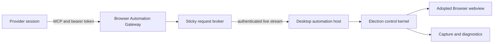

# Design: Agent Browser Automation

**Author:** Chukwudi Nwobodo  
**Status:** Implemented, verification in progress  
**Date:** 2026-07-18  
**Epic:** [#881](https://github.com/Mzeey-Empire/mcode/issues/881)

## Summary

Mcode should let an agent control the same Browser tab the user sees. The agent must share the page's cookies, navigation state, active tab, and rendered DOM. Human input must take control immediately, and every provider must receive the feature through one secure, typed interface.

Mcode already owns the browser substrate for this work: renderer-hosted webviews, tab persistence, warm and cold tabs, CDP access, capture redaction, console and failed-request diagnostics, and a typed Browser v2 gateway.

The recommended change is therefore an integration project, not a browser rewrite. Add a provider-neutral Browser Automation Gateway in the server, a sticky request broker, and a serialized Electron control kernel. Reuse the existing Browser UI and capture pipeline. Browser v2 is now the only provider path.

This document defines an Mcode migration plan.

## Decision

Build one loopback-only MCP server named `mcode-browser`. Give each active provider session a short-lived, capability-scoped bearer credential. Route authenticated operations through the Mcode server to the connected Electron instance that owns the thread's Browser tabs. Execute operations against the existing adopted webview `webContents`.

Use the Browser v2 tools `browser_open`, `browser_inspect`, `browser_act`, and `browser_tabs`. Do not expose raw CDP over MCP. Restrict arbitrary page evaluation to Full Build sessions, execute it in an isolated world, and bound its input, output, and runtime.

Connect Codex, Claude, Cursor, and GitHub Copilot to the same Browser v2 contract through each provider's supported MCP configuration.

## Mcode Current State

Mcode already has these foundations:

- A renderer-hosted `<webview>` Browser surface in `PreviewWebview.tsx`.
- Main-process tab ownership and warm or cold tab lifecycle in the preview session.
- Adopted webview lookup and CDP execution in `apps/desktop/src/main/preview/` and `apps/desktop/src/main/browser-automation/`.
- Browser tab and Browser v2 contracts in `packages/contracts`.
- Screenshot and page-context capture with redaction and bounded spill storage.
- Console and failed-request diagnostics.
- Provider session runtimes for Codex, Claude, and Cursor.
- A shared permission request and decision model.

The typed Browser v2 gateway is the product boundary:

| Current behavior | Gap |
|---|---|
| Browser v2 exposes typed, semantic operations. | Every provider uses a standard MCP configuration and scoped credential. |
| Session state is process-wide. | Calls need provider, workspace, thread, desktop owner, and tab scope. |
| CDP events can be broadcast to connected sockets. | Results and events must return only to the authorized session. |
| `createTab` can return the current tab. | Open and tab targeting need explicit behavior and errors. |
| No broker models the live owner. | The server cannot safely route around reconnects, multiple windows, or remote environments. |
| Actions are not serialized by tab. | Concurrent calls can race navigation, focus, typing, and snapshot state. |
| No human override model exists. | An agent can contend with the user's keyboard or pointer. |
| Browser state is visible, but agent activity is not. | Users need controller status, action focus, and a reliable stop path. |

## Goals

- Let an agent inspect and control the Browser tab visible in Mcode.
- Preserve cookies, session storage, navigation history, and page state across human and agent control.
- Give Codex, Claude, Cursor, and GitHub Copilot the same semantic tool contract.
- Keep authentication, routing, validation, and output limits at process boundaries.
- Make human input win within the current action, without waiting for the model turn to end.
- Keep every request bound by time, queue depth, payload size, and result size.
- Show enough agent activity that a user can understand and stop browser control.
- Work with tab switching, cold-tab restoration, thread switching, server restart, and desktop reconnect.

## Non-Goals

- Launching a hidden Chromium or a standalone Playwright browser.
- Supporting Firefox, WebKit, or an external Chrome profile.
- Giving agents direct access to raw CDP.
- Automating `file:`, `mcode-workspace:`, browser-internal, extension, or development-tools URLs in the first release.
- Solving cloud browser hosting or unattended remote automation.
- Persisting screenshots or full page content as long-term history.
- Replacing the Browser tab, capture pipeline, or memory-saver design.

## Target Architecture



### 1. Shared browser automation contracts

Add lazy Zod schemas under `packages/contracts`. The contract owns:

- Operation names and argument schemas.
- A versioned request and response envelope.
- Stable error codes.
- Host capability negotiation.
- Credential claims.
- Snapshot, diagnostics, and image metadata.
- Maximum URL, selector, text, timeout, queue, image, and result sizes.

The MCP layer and Electron host must both parse at their trust boundaries. Code inside each layer may trust the normalized value.

### 2. Browser Automation Gateway

Add a loopback-only Streamable HTTP MCP endpoint in the Mcode server. It owns tool discovery, bearer authentication, operation annotations, conversion between MCP content and internal contracts, and provider-session lifecycle.

Each provider session receives a random credential with these claims:

```text
credentialId
workspaceId
threadId
provider
providerSessionId
providerInstanceId
capabilities: [browser]
issuedAt
lastUsedAt
expiresAt
```

Generate at least 256 bits of cryptographic randomness. Store only the token hash. Set a 30-minute idle expiry and an eight-hour absolute lifetime. Revoke credentials when the provider session stops, the thread is deleted, the user signs out, or the server shuts down. Never log the token, authorization header, snapshot content, typed text, or a URL query string.

### 3. Sticky request broker

The broker tracks live automation hosts and assigns each provider session to one host and Browser tab. An assignment remains sticky until the tab closes, the host disconnects, the provider session ends, or the user explicitly moves control.

Host selection uses this order:

1. Matching workspace and thread.
2. Support for the requested operation and contract version.
3. Existing sticky assignment.
4. Focused matching Browser surface.
5. Most recently active matching host.

The broker owns a bounded pending-request map. Each request has an ID, sequence number, deadline, cancellation signal, and one terminal response. Host disconnect, tab close, timeout, provider interruption, and server shutdown must reject pending work with typed errors.

Do not silently move a multi-step sequence to another tab. Return `browser_target_lost` and require the agent to call `browser_inspect` again.

### 4. Desktop automation host

The desktop registers a live host after the server connection is authenticated. Registration includes the desktop instance, worktree identity, supported contract versions, supported operations, active thread and tab, focus state, and a monotonic connection ID.

The host resolves only Browser tabs owned by its window and worktree. Harden webview adoption before enabling automation:

- Confirm the IPC sender is the expected `BrowserWindow`.
- Confirm the supplied guest is an Electron `webview`.
- Confirm `hostWebContents` belongs to the sender.
- Confirm the guest uses the expected persistent partition.
- Confirm the tab belongs to the authorized thread.

### 5. Electron control kernel

Build a high-level executor around the existing active-preview `webContents` resolver and CDP bridge. The kernel attaches the debugger once per guest and enables only required CDP domains. It owns one FIFO action semaphore per tab.

Each tab has this ephemeral control state:

```text
controller: none | human | agent
controlEpoch: integer
activeRequestId: string | null
expectedSyntheticInputUntil: timestamp | null
heldKeys: bounded set
actionTimeline: bounded ring buffer
```

Real keyboard, pointer, touch, focus, or navigation input increments `controlEpoch`. An agent action captures the epoch before work and checks it before every meaningful step. A mismatch cancels the action, releases held keys, clears temporary focus state, and returns `browser_interrupted_by_user`. Synthetic input marks a short expected-input window so it does not trigger its own cancellation.

Use native CDP input for click, key press, and scroll. Use the page runtime for text insertion when Electron drops hidden-guest `Input.insertText`. Use a tested injected selector runtime for semantic locators rather than maintaining a custom selector engine.

### 6. Browser UI integration

Keep the current Browser panel and tab model. Add only the states required for safe collaboration:

- A compact Human or Agent controller indicator.
- A visible agent pointer during pointer actions.
- A stop-control action that cancels the active browser request and provider tool call.
- A brief focus treatment on the element or coordinates being acted upon.
- An unavailable state when the provider has browser tools but no live desktop owner.

Opening the browser through `browser_open` may reveal the existing right panel. It must not create a second Browser surface or silently change threads.

## Tool Contract

Use `browser_*` names because Browser is Mcode's product term. The MCP server name is `mcode-browser`.

| Tool | Purpose | Default classification |
|---|---|---|
| `browser_open` | Reveal the current thread's Browser panel and create a tab only when none exists. | UI mutation, idempotent |
| `browser_inspect` | Return the current tab observation, readiness, capabilities, bounded diagnostics, and optional PNG. | Read-only |
| `browser_act` | Execute a bounded, observation-bound batch of Browser steps. | Destructive, observation-bound |
| `browser_tabs` | Select, claim, release, close, or finalize assigned Browser tabs. | Destructive, lifecycle-bound |
| `browser_evaluate` | Evaluate bounded JavaScript in the automation isolated world. | Privileged |

`browser_evaluate` requires a privileged credential, which maps to a Full Build session. It uses strict result serialization, a 64 KB expression limit, a bounded result, and a hard timeout. Evaluation is not read-only because JavaScript can mutate or expose page state.

Every targeting operation accepts exactly one of:

- A semantic locator returned by the most recent snapshot.
- A role and accessible-name locator.
- A bounded CSS selector for compatibility.
- An `x` and `y` coordinate pair within the current viewport.

Reject ambiguous targets. Semantic locators are preferred because they survive layout changes and match accessibility behavior.

## Snapshot Contract

`browser_inspect` returns a coherent observation from one tab and one control epoch:

```text
url, title, loading, viewport
redacted visible text
bounded semantic interactive elements
bounded accessibility summary
bounded console warnings and errors
bounded failed network requests
bounded recent action timeline
optional PNG image content
snapshotId, tabId, controlEpoch, capturedAt
```

Recommended initial limits:

| Field | Limit |
|---|---:|
| URL | 2,048 characters |
| Typed text | 16,384 characters per operation |
| Wait or action timeout | 60 seconds maximum, 15 seconds default |
| Visible text | 20,000 characters |
| Interactive elements | 200 |
| Accessibility nodes | 1,000 |
| Console entries | 200 |
| Failed requests | 200 |
| Action timeline | 200 |
| Screenshot width | 1,280 pixels |
| Serialized non-image result | 512 KB |
| Pending requests per host | 32 |

Reuse the current capture redaction and spill rules. Add redaction coverage for password inputs, authorization values, cookies, storage tokens, hidden form values, and fields marked sensitive by page semantics. A snapshot must identify truncation rather than presenting partial content as complete.

## Provider Integration

Provider adapters receive an MCP endpoint and per-session credential from one server service. They must not construct credentials themselves.

| Provider | Integration path | Release gate |
|---|---|---|
| Codex | Add `mcode-browser` to app-server MCP configuration with the bearer token in a protected environment variable. | First provider, full live suite |
| Claude | Register the Streamable HTTP MCP server through the SDK session configuration and scoped header. | Contract parity with Codex |
| Cursor | Replace the current empty ACP MCP server list with the scoped Mcode server entry when supported by the active protocol version. | Capability detection and a typed unsupported result |
| GitHub Copilot | Register `mcode-browser` in the SDK session MCP configuration with the shared tool metadata. | Contract parity and live subscription check |

Tool availability follows provider capability detection. If a provider version cannot accept HTTP MCP, hide the tools and report the missing capability in startup status. Do not advertise tools that will fail later.

Browser v2 is the only supported provider path, with one scoped MCP surface for every provider.

## Security and Privacy

Browser automation crosses provider, HTTP, WebSocket, IPC, guest-content, and filesystem trust boundaries. Apply these rules before granting Browser v2 access:

- Bind MCP to loopback and a random worktree-local port.
- Authenticate every MCP request and live-host registration.
- Authorize workspace, thread, provider session, capability, and operation.
- Use cryptographic tokens, hashed storage, expiry, revocation, and bounded idle refresh.
- Accept only `http:` and `https:` navigation in the first release.
- Reject embedded credentials and strip fragments from logs. Redact query strings from logs.
- Keep local-file navigation in the existing trusted preview path, outside agent automation.
- Deny popups and guest permissions by default. Add origin allowlists only for a concrete product need.
- Keep downloads disabled until a separately reviewed download boundary exists.
- Parse and bound every request, response, queue, selector, result, screenshot, and diagnostic buffer.
- Keep typed text out of narration, telemetry, logs, and action-history details.
- Clear credentials and pending requests on provider stop, thread deletion, sign-out, server stop, and desktop disconnect.
- Run the repository security checklist before enabling the feature flag by default.

## Failure Semantics

Errors use stable codes plus a short safe message. Internal stack traces stay in local debug logs.

| Condition | Error | Required behavior |
|---|---|---|
| No matching desktop host | `browser_unavailable` | Return immediately with recovery guidance. |
| Browser panel has no tab | `browser_target_missing` | `browser_open` may create one; other tools fail. |
| Assigned tab closed or discarded mid-action | `browser_target_lost` | Cancel and require a fresh status or snapshot. |
| User takes control | `browser_interrupted_by_user` | Stop input, release keys, preserve page state. |
| Navigation leaves the allowed scheme | `browser_navigation_blocked` | Fail closed without starting navigation. |
| Operation exceeds deadline | `browser_timeout` | Cancel pending host work and ignore late responses. |
| Host disconnects | `browser_host_disconnected` | Reject all pending requests for that connection. |
| Provider credential expires or is revoked | `browser_unauthorized` | Return HTTP 401 without revealing scope details. |
| Snapshot exceeds a field limit | Successful truncated result | Mark every truncated field and omit excess data. |
| Result exceeds the total limit | `browser_result_too_large` | Do not stream an unbounded partial payload. |
| Contract versions do not overlap | `browser_version_unsupported` | Hide unsupported tools at discovery when possible. |

## HMM Implementation Plan

Each slice is independently reviewable and leaves the existing browser path usable.

### Slice 0: Contract and threat model

Deliverables:

- Versioned lazy Zod schemas, limits, error codes, tool metadata, and host capabilities.
- A short threat model covering provider, MCP, WebSocket, IPC, guest, URL, and capture boundaries.
- Webview adoption hardening and focused tests.
- A feature flag defaulted off.

Acceptance:

- Invalid and oversized inputs fail at the first boundary.
- Every operation has a classification, timeout, and output bound.
- An IPC sender cannot adopt another window's guest or a non-webview guest.

### Slice 1: Desktop control kernel

Deliverables:

- High-level status, snapshot, click, type, press, scroll, wait, and navigate operations against the current Browser webview.
- Per-tab action semaphore, control epoch, cancellation, held-key cleanup, and bounded action timeline.
- Semantic locator runtime and current capture-pipeline reuse.
- No provider integration yet. Exercise through a development-only harness.

Acceptance:

- Operations act on the visible page and preserve its cookies and state.
- Two operations cannot race on one tab.
- Real keyboard or pointer input interrupts within the active action.
- A cold, closed, crashed, or replaced tab returns the specified error.

### Slice 2: Gateway, credentials, and broker

Deliverables:

- Loopback Streamable HTTP MCP server.
- Credential registry with hash-only storage, idle and absolute expiry, and revocation.
- Sticky broker, live-host registration, capability negotiation, bounded pending queue, timeout, cancellation, and disconnect cleanup.
- MCP contract and transport integration tests.

Acceptance:

- Unauthorized requests receive HTTP 401.
- A provider session stays on one host and tab across a multi-step sequence.
- Host loss rejects pending work and never reroutes an in-flight sequence.
- Tokens and sensitive arguments never appear in logs.

### Slice 3: Codex vertical slice

Deliverables:

- Per-session MCP injection into Codex app-server.
- Tool availability in startup status.
- Browser controller indicator, stop action, and visible pointer.
- Focused tests plus a live desktop scenario driven by a real Codex turn.

Acceptance:

- Codex opens the Browser, navigates to a local test app, snapshots it, clicks, types, waits, and verifies the resulting page state.
- The user can interrupt during typing and regain control without stuck keys.
- Restarting the server or closing the tab produces the documented error and recovery path.

### Slice 4: Claude and Cursor parity

Deliverables:

- Scoped HTTP MCP injection for Claude.
- Version-aware ACP MCP injection for Cursor.
- Provider capability matrix and startup diagnostics.
- The same live behavior suite for every supported provider.

Acceptance:

- The shared suite passes without provider-specific tool semantics.
- Unsupported provider versions do not see unusable browser tools.
- Session stop revokes only that session's credential and pending calls.

### Slice 5: Diagnostics, resize, and recording

Deliverables:

- Bounded console, failed-request, accessibility, and action-timeline snapshot data.
- Design-mode viewport resize.
- Visible-tab recording using the current Browser guest, with bounded duration and artifact size.
- Remote localhost mapping only if Mcode has a remote environment owner at implementation time.

Acceptance:

- Diagnostics match the observed tab and snapshot epoch.
- Redaction tests cover sensitive fields and truncation.
- Recording start and stop races cannot leak a recorder, stream, or pending request.

### Slice 6: Stable Browser v2 operations

Deliverables:

- One stable Browser v2 contract for every supported provider.
- Content-free counters for tool latency, timeout, interruption, host loss, and result truncation.

Acceptance:

- Error and latency budgets remain within the agreed release thresholds.
- Browser v2 covers every supported Browser automation workflow.

## Verification Matrix

### Contract and unit tests

- Schema rejection for invalid URLs, schemes, selectors, coordinate pairs, timeouts, text, and payload sizes.
- Credential issue, hash lookup, idle expiry, absolute expiry, revocation, and session isolation.
- Sticky assignment, unsupported operation, host disconnect, target loss, timeout, late response, cancellation, and bounded queues.
- Control epoch interruption before and during CDP input, synthetic-input filtering, semaphore order, and held-key cleanup.
- Snapshot redaction, truncation markers, total result bounds, and image metadata.
- Webview sender, type, host ownership, partition, thread, and tab validation.

### Integration tests

- MCP initialization, tool discovery, annotations, authorized call, unauthorized call, cancellation, and image content.
- Server-to-desktop live request and response over the authenticated stream.
- Provider configuration injection and secret removal for Codex, Claude, and Cursor.
- Tab close, thread switch, memory-saver discard, server restart, desktop reconnect, and provider resume.
- Browser v2 behavior across provider configuration and live host routing.

### Live desktop checks

Run the canonical worktree runtime and Electron desktop. For each supported provider:

1. Open the Browser from an agent turn.
2. Navigate to a controlled local application.
3. Snapshot, click, type, press, scroll, wait, and inspect diagnostics.
4. Confirm the user sees the same page, cookies, cursor, and resulting state.
5. Interrupt a long action with real pointer and keyboard input.
6. Repeat with a background tab, cold tab, closed tab, offline server, and reconnected desktop.
7. Check permission prompts, blocked schemes, popup denial, redaction, and log output.

Run this suite on Windows, macOS, and Linux. Keyboard modifiers, hidden guest behavior, CDP attachment, and recording differ by platform. Finish every slice with focused tests, typecheck, and lint.

## Rollout and Compatibility

Browser v2 is the only supported Browser automation path. Provider sessions
receive the same scoped MCP contract.

Do not combine protocol migration with Browser UI redesign. A small controller indicator, pointer, and stop action are part of the safety model; other visual changes are separate work.

## Alternatives Considered

### Extend the raw pipe

Rejected as the product boundary. It lacks provider-neutral discovery, scoped authentication, high-level schemas, browser-owner routing, and tool annotations.

### Launch a separate Playwright browser

Rejected. It would have different cookies, storage, focus, viewport, and page state from the Browser tab the user sees. It would also increase process and memory cost.

### Put the MCP server in Electron

Rejected. Provider sessions and their lifecycle live in the server. Moving authentication and provider configuration into Electron would invert ownership and complicate web or remote routing.

### Route every call to the focused tab

Rejected. Focus can change between observation and action. Sticky assignment plus explicit target loss is safer and easier for an agent to reason about.

### Include arbitrary evaluation in the first release

Rejected. High-level tools cover the core workflow, while evaluation can mutate page state, read sensitive values, and bypass operation-level controls.

## Blast Radius

The change crosses package and process boundaries. Review these areas together:

- Browser v2 tab contracts, contract exports, and generated client types.
- Desktop Browser automation host, preview session, webview adoption, tab lifecycle, preload bridge, and IPC tests.
- Server startup, HTTP routing, WebSocket subscriptions, protected environment handling, session runtime, provider adapters, permission flow, and shutdown cleanup.
- Codex app-server configuration, Claude SDK session options, Cursor ACP session configuration, provider startup status, and provider tests.
- Web Browser panel, `PreviewWebview`, tab store, panel visibility, controller UI, cancellation, and accessibility tests.
- Runtime documentation, settings reference, provider architecture guide, and the final architecture document after implementation.

The repository dependency index did not resolve several TypeScript path aliases and `.js` specifiers back to their source files during this analysis. The blast-radius list therefore combines the index with direct import searches. Implementation review must repeat both checks against the final changed symbols.

## Definition of Done

The feature is done only when:

- Codex, Claude, and supported Cursor versions receive the same bounded MCP tools.
- A real agent controls the visible Mcode Browser and shares its state.
- Human input reliably interrupts agent control.
- Authentication, routing, URL validation, redaction, permissions, limits, cleanup, and typed failures have focused tests.
- Live desktop scenarios pass on Windows, macOS, and Linux.
- Focused tests, typecheck, and lint pass from the monorepo root.
- Browser v2 diagnostics remain bounded and content-free.
- Architecture, provider, settings, and runtime documentation match the shipped behavior.
