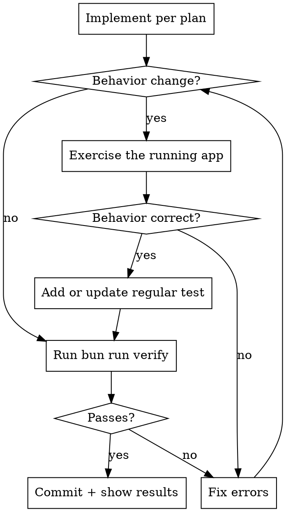

# Agent Workflow

Mandatory workflow for autonomous code implementation. Stop hooks enforce
verification; you cannot finish a turn with failing checks.

## Workflow



## Verify (mandatory, enforced)

Verification has two tiers. The stop hook runs the **fast gate** on every
turn so type errors and lint violations surface in seconds; the **full gate**
runs at commit time and adds the unit-test suite on top.

| Tier | When it runs | What it runs | How to invoke |
|------|--------------|--------------|---------------|
| Fast gate | Every agent stop hook | Typecheck + Lint (parallel) | `node scripts/agent/verify-fast.mjs` |
| Full gate | Before committing | Typecheck + Lint + Tests (parallel) | `bun run verify` |

Both tiers share the same `hasCodeChanges()` early-exit bypass, so
brainstorming-only sessions with no code edits skip verification entirely.

The Stop hook calls the fast gate automatically when you try to finish a
turn. If typecheck or lint fails, you get the error output and must fix
before you can stop. **Before committing**, run `bun run verify` yourself
to exercise the full gate, including the unit tests. The fast gate alone
does not certify a commit.

Do not run `tsc --noEmit` or test commands individually. Use the tier
appropriate for what you are doing.

**Test scope.** `bun run verify` runs the full unit-test gate whenever
verification runs (it still skips entirely when no code changes are detected).
The Stop hook calls `verify-tests.mjs` directly without `--full`, so it scopes
each workspace's vitest run to tests related to the changed files
(`vitest related <files> --run`) for fast feedback. Any change inside
`packages/contracts` or `packages/shared` falls back to the full suite because
those packages are imported across the repo and vitest's related-file import
graph is per-project.

## Live Verification

Run the affected app and exercise the changed path as a user or client would.
Prefer browser use for web surfaces and computer use for Electron-only surfaces.
These tools can inspect runtime state, console output, accessibility state, layout,
and screenshots without adding a permanent browser test harness to the repository.

For web work, start the runtime with `bun run dev:web`. When the isolated agent
runtime is present, read its URL from `.dev/ports.json`. For Electron-only work,
start the normal desktop development runtime and inspect it with computer use.

Record the action, the observed result, and relevant errors or measurements in
the final report. UI changes require a screenshot or equivalent visual evidence.
If live verification is blocked, state the blocker and the manual check required.

## Disposable Verification Code

Agents may write one-off scripts, fixtures, benchmarks, annotations, logs, or
screenshots under `.dev/verification/`. Create subdirectories only when useful.
Everything in this directory is ignored and disposable. Do not promote these
artifacts into tracked tests or agent commands.

Playwright may be used from an external agent or system installation when it is
the best probe for a task. The repository does not install or configure it as a
default verification engine.

## Maintained Behavior Tests

Keep durable regression coverage close to the behavior it protects. Use Vitest
or Testing Library in the closest `__tests__/` directory for components, stores,
services, IPC boundaries, and product rules. If live verification exposes a
regression, add the smallest regular test that would have caught it.

## Deliver

Commit with a conventional commit message. Show `bun run verify` output as
evidence that checks passed.

## Before You Declare Done

- [ ] `bun run verify` (the full gate, including unit tests) passes
- [ ] Behavior changes exercised against the running app
- [ ] UI changes inspected visually with browser use or computer use
- [ ] Durable behavior protected by a focused regular test
- [ ] No relevant runtime or browser console errors

The fast gate that the stop hook ran during the turn is not sufficient on
its own because it skips the unit test phase. Run `bun run verify` explicitly
before committing.

## Enforcement

| Agent | Config | Block mechanism |
|-------|--------|-----------------|
| Claude Code | `.claude/settings.json` | exit code 2 |
| Cursor | `.cursor/hooks.json` | exit code 2 via `scripts/agent/hooks/cursor-stop.mjs` |
| Codex | `.codex/hooks.json` | JSON `{"decision":"block"}` via `scripts/agent/hooks/codex-stop.mjs` |

PreToolUse hooks also block direct `.env` file edits across all agents.

## One-time cleanup

After the first per-build nightly release lands, run:

```bash
GH_TOKEN=$(gh auth token) node scripts/agent/one-time-cleanup-rolling-nightly.mjs --confirm
```

This deletes the legacy rolling `nightly` release (49 stale assets) and its tag. Clients on the nightly channel auto-rediscover via `allowPrerelease`.
