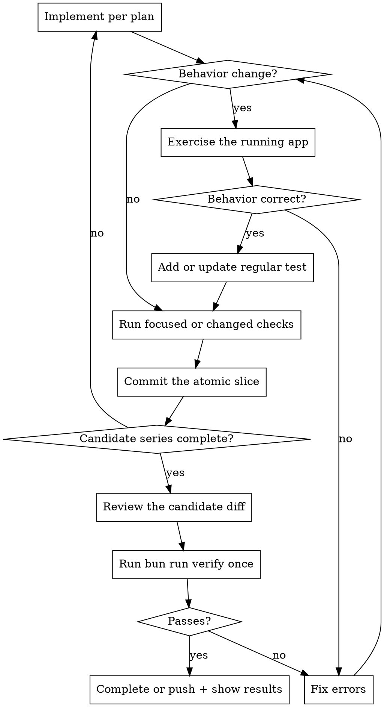

# Agent Workflow

Mandatory workflow for autonomous code implementation. Explicit verification
creates receipts, and Stop hooks require a current receipt before completion.

## Workflow



## Verify and receipts (mandatory, enforced)

Verification has two explicit gates. Each successful or failed run writes a
receipt for the effective repository content and selected test scope. Stop hooks
inspect receipts; they do not run verification phases.

| Tier | When it runs | What it runs | How to invoke |
|------|--------------|--------------|---------------|
| Changed-file gate | During implementation, before an atomic commit when appropriate | Typecheck + lint + smallest safe maintained test scope | `bun run verify:changed` |
| Full gate | Once after the candidate commit series and before completion or push | Typecheck + lint + complete unit-test suite | `bun run verify` |

Both gates skip when no verification-relevant files changed. Code, package
manifests, lockfiles, verification scripts, and root build or test configuration
are relevant. Documentation-only sessions skip verification.

Claude, Codex, and Cursor Stop hooks inspect the current content and planning
identities. No relevant changes approve immediately. A matching success receipt
approves, and a matching failure receipt blocks with its manifest path. A stale
or missing receipt blocks with `bun run verify:changed` as the next command.
Stop inspection creates no verification run or log.

Content identity follows effective verification-relevant file contents, tool
and runtime identity, verification configuration, and selected environment
digests. Planning identity follows the changed-file set and selected test scope
relative to the main baseline. Staging, unstaging, or committing unchanged
content does not invalidate a receipt when the diff relative to main stays the
same. A full-gate success covers a changed-file Stop check only when both
identities match. A changed-file success never covers the full gate, and failed
receipts never cross gates. Direct verification commands always run fresh.

Several atomic commits may occur in one agent turn. Protect each logical slice
with its focused test or the changed-file gate as appropriate. Run the full gate
once after the candidate commit series. Mcode adds no heavy per-commit hook.

Use a focused repository-native command to reproduce a failed phase before
editing. After the repair, rerun that command and the affected checks. Focused
commands diagnose a failure; they do not replace `bun run verify`.

**Test scope.** The changed-file gate runs related Vitest tests for web, server,
and desktop changes. Changes in `packages/contracts`, `packages/shared`, root
verification configuration, manifests, or lockfiles fall back to the complete
unit-test suite. Changes under `scripts/agent` run `bun run test:scripts`.
Typecheck, lint, and unit tests run in parallel. Agent script tests run after
those phases because their Git fixtures otherwise compete with integration
tests for processes and temporary repositories.

**Diagnostics.** Passing phases print one summary line. Each phase streams its
complete output to `.dev/verification/`, while failures print a bounded excerpt,
the bounded argument vector, a reproduction command when every token is safe,
the working directory, exit condition, full-log
path, and manifest path. Manifests distinguish nonzero exits, spawn errors,
signals, timeouts, and cancellations. Completed artifacts use bounded retention.

## Failure recovery

1. Exercise runtime behavior first when behavior changed.
2. Add or update the nearest meaningful maintained test.
3. Run focused checks or `bun run verify:changed` while diagnosing.
4. If a broad gate fails, reproduce its smallest failed phase before editing.
5. Fix the root cause. Do not weaken or skip a test.
6. Rerun the focused failure and affected checks.
7. Commit the repaired atomic slice after its focused checks pass.
8. Review the complete candidate diff.
9. Run `bun run verify` once after the candidate commit series and before
   completion or push.
10. Rerun the full gate only after relevant code, configuration, environment, or
   generated artifacts change.

## Live Verification

Run the affected app and exercise the changed path as a user or client would.
Prefer browser use for web surfaces and computer use for Electron-only surfaces.
These tools can inspect runtime state, console output, accessibility state, layout,
and screenshots without adding a permanent browser test harness to the repository.

For web work, start the runtime with `bun run dev:web`. When the isolated agent
runtime is present, read its URL from `.dev/ports.json`. For Electron-only work,
start the normal desktop development runtime and inspect it with computer use.

Record the action, the observed result, and relevant errors or measurements in
the final report. UI changes require a screenshot or equivalent visual evidence.
If live verification is blocked, state the blocker and the manual check required.

## Disposable Verification Code

Agents may write one-off scripts, fixtures, benchmarks, annotations, logs, or
screenshots under `.dev/verification/`. Create subdirectories only when useful.
Everything in this directory is ignored and disposable. Do not promote these
artifacts into tracked tests or agent commands.

Playwright may be used from an external agent or system installation when it is
the best probe for a task. The repository does not install or configure it as a
default verification engine.

## Maintained Behavior Tests

Keep durable regression coverage close to the behavior it protects. Use Vitest
or Testing Library in the closest `__tests__/` directory for components, stores,
services, IPC boundaries, and product rules. If live verification exposes a
regression, add the smallest regular test that would have caught it.

## Deliver

Use conventional, atomic commits. Show the final `bun run verify` output as
evidence before completion or push.

## Before You Declare Done

- [ ] `bun run verify` (the full gate, including unit tests) passes
- [ ] Behavior changes exercised against the running app
- [ ] UI changes inspected visually with browser use or computer use
- [ ] Durable behavior protected by a focused regular test
- [ ] No relevant runtime or browser console errors

The changed-file gate is not sufficient on its own. Run `bun run verify`
explicitly after the candidate commit series and before completion or push.

## Enforcement

| Agent | Config | Block mechanism |
|-------|--------|-----------------|
| Claude Code | `.claude/settings.json` | exit code 2 |
| Cursor | `.cursor/hooks.json` | exit code 2 via `scripts/agent/hooks/cursor-stop.mjs` |
| Codex | `.codex/hooks.json` | JSON `{"decision":"block"}` via `scripts/agent/hooks/codex-stop.mjs` |

PreToolUse hooks also block direct `.env` file edits across all agents.

## One-time cleanup

After the first per-build nightly release lands, run:

```bash
GH_TOKEN=$(gh auth token) bun scripts/agent/one-time-cleanup-rolling-nightly.mjs --confirm
```

This deletes the legacy rolling `nightly` release (49 stale assets) and its tag. Clients on the nightly channel auto-rediscover via `allowPrerelease`.
