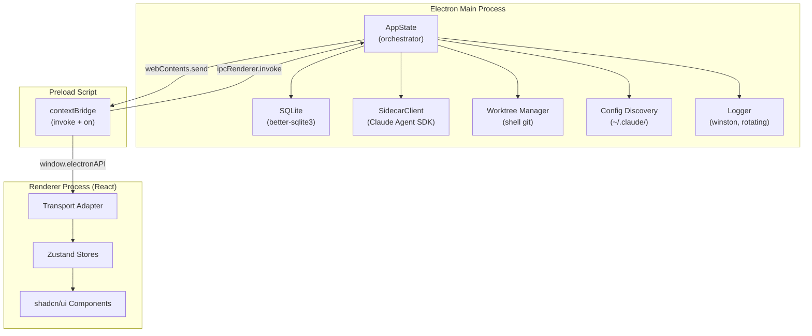
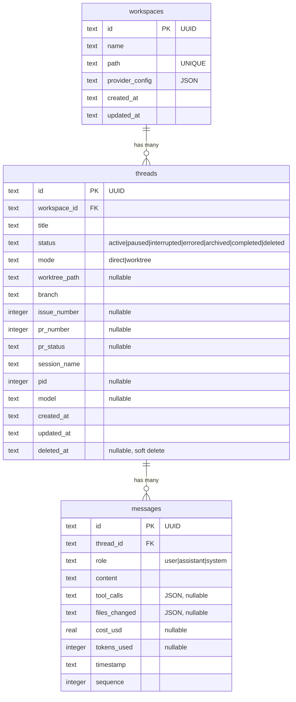
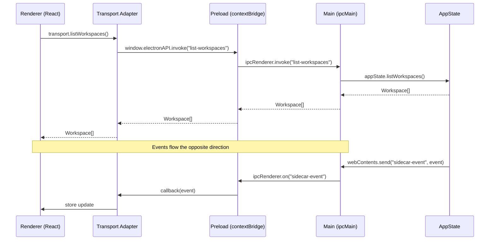
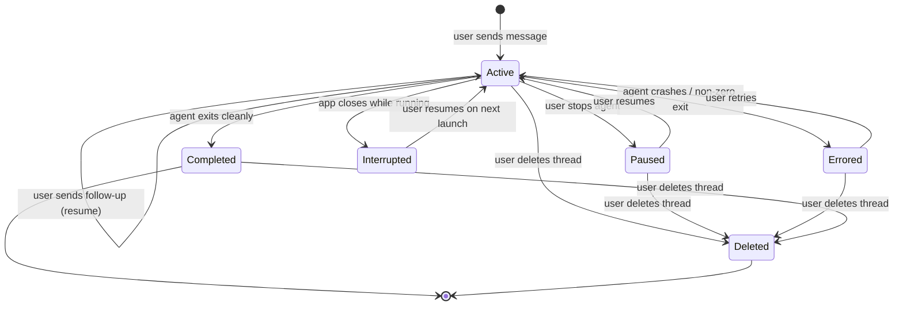
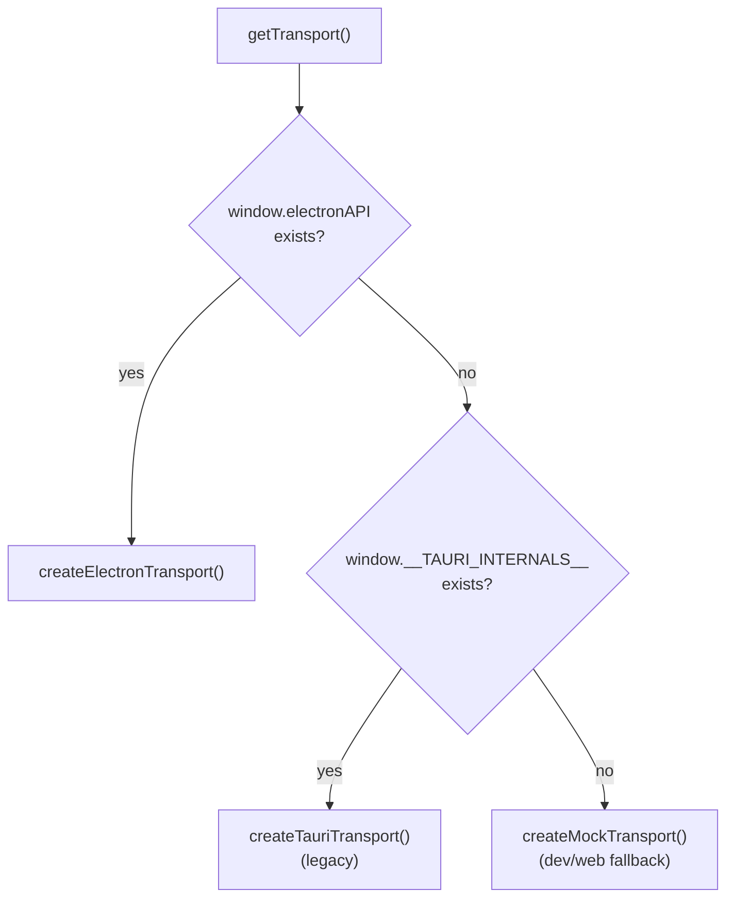
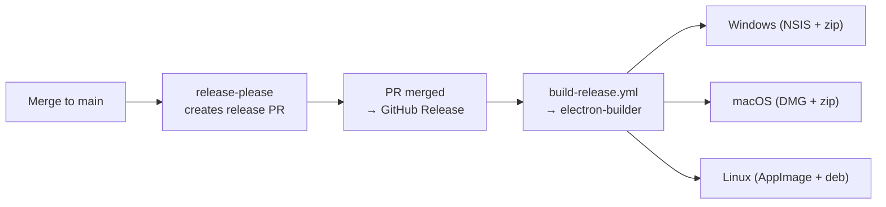

# Documentation Update Implementation Plan

> **For Claude:** REQUIRED SUB-SKILL: Use superpowers:executing-plans to implement this plan task-by-task.

**Goal:** Replace outdated Tauri/Rust documentation with accurate Electron/TypeScript docs using numbered sections and Mermaid diagrams.

**Architecture:** Four files to touch: archive the old design doc, create a new `ARCHITECTURE.md` at repo root, rewrite `README.md`, and trim `AGENTS.md` to agent-only concerns (pointing to ARCHITECTURE.md for the full picture).

**Tech Stack:** Markdown, Mermaid diagrams

---

## Task 1: Archive the old design doc

**Files:**
- Rename: `docs/plans/2026-03-22-mcode-design.md` to `docs/plans/2026-03-22-mcode-design-tauri-original.md`

**Step 1: Rename the file**

```bash
cd /path/to/repo
git mv docs/plans/2026-03-22-mcode-design.md docs/plans/2026-03-22-mcode-design-tauri-original.md
```

**Step 2: Commit**

```bash
git add docs/plans/
git commit -m "docs: archive original Tauri design doc"
```

---

## Task 2: Create `ARCHITECTURE.md`

**Files:**
- Create: `ARCHITECTURE.md` (repo root)

The document uses numbered sections and Mermaid diagrams throughout. Content must reflect the actual codebase (Electron 35, TypeScript, better-sqlite3, Claude Agent SDK).

**Step 1: Write `ARCHITECTURE.md`**

Use these numbered sections. Every diagram is Mermaid (no ASCII art).

```markdown
# Architecture

## 1. Overview

Mcode is a desktop app for orchestrating AI coding agents. It manages multiple Claude agent sessions across git repositories, with config inheritance from the user's Claude Code setup and git worktree isolation per thread.

Built with Electron (TypeScript) and React. The frontend is a separate package (`apps/web`) that communicates with the main process through a transport adapter, allowing future web or alternative desktop targets.

## 2. Tech Stack

| Layer | Technology |
|-------|-----------|
| Runtime | Bun (package manager + script runner) |
| Monorepo | Turborepo |
| Desktop | Electron 35, electron-vite |
| Main process | TypeScript, better-sqlite3, Claude Agent SDK |
| Frontend | React 19, Vite, shadcn/ui, Tailwind CSS 4, Zustand |
| Database | SQLite (WAL mode, better-sqlite3) |
| Testing | Vitest (unit), Playwright (E2E) |
| CI/CD | GitHub Actions, release-please, electron-builder |

## 3. System Architecture



## 4. Project Structure

```text
apps/
├── desktop/                  # Electron app
│   └── src/
│       ├── main/             # Main process (TypeScript)
│       │   ├── index.ts      # Entry point, IPC handlers, lifecycle
│       │   ├── app-state.ts  # Central orchestrator
│       │   ├── models.ts     # Shared types (Workspace, Thread, Message)
│       │   ├── sidecar/      # Claude Agent SDK integration
│       │   │   ├── client.ts # In-process SDK query runner
│       │   │   └── types.ts  # SidecarEvent discriminated union
│       │   ├── store/        # SQLite database
│       │   │   ├── database.ts    # Connection, WAL mode, migrations
│       │   │   └── migrations/    # Forward-only SQL migrations
│       │   ├── repositories/ # Data access (repository pattern)
│       │   │   ├── workspace-repo.ts
│       │   │   ├── thread-repo.ts
│       │   │   └── message-repo.ts
│       │   ├── worktree.ts   # Git worktree via shell commands
│       │   ├── config.ts     # Claude config discovery (~/.claude/)
│       │   └── logger.ts     # Winston rotating file logger
│       └── preload/
│           └── index.ts      # contextBridge: expose invoke + on
├── web/                      # React frontend
│   └── src/
│       ├── app/              # Routes (TanStack Router) and providers
│       ├── components/       # UI: sidebar, chat, terminal, diff
│       ├── stores/           # Zustand state management
│       ├── transport/        # Runtime adapter (Electron / Tauri / mock)
│       │   ├── index.ts      # Auto-detect environment
│       │   ├── electron.ts   # window.electronAPI bindings
│       │   ├── tauri.ts      # @tauri-apps/api bindings (legacy)
│       │   └── types.ts      # McodeTransport interface
│       └── lib/              # Utilities and shared types
docs/plans/                   # Design and planning docs
```

## 5. Data Layer

### 5.1 Schema



### 5.2 Migrations

Forward-only SQL files in `apps/desktop/src/main/store/migrations/`. Applied on app startup by `database.ts`. Currently one migration: `V001__initial_schema.sql`.

### 5.3 Repository Pattern

Each entity has a dedicated repository module (`*-repo.ts`) that encapsulates all SQL queries. Repositories accept a `Database` instance and return typed objects. AppState coordinates access.

## 6. IPC Layer

Communication between renderer and main process flows through Electron's contextBridge.



The preload script exposes two methods on `window.electronAPI`:
- `invoke(channel, ...args)` for request/response commands
- `on(channel, callback)` for streaming events (returns unsubscribe function)

## 7. Agent Integration

### 7.1 Claude Agent SDK (In-Process)

The `SidecarClient` imports `@anthropic-ai/claude-agent-sdk` directly and runs the `query()` async generator in-process. No child process is spawned. The client emits typed `SidecarEvent` objects on an EventEmitter interface.

### 7.2 Session Lifecycle



### 7.3 Event Flow

The SDK emits these event types through the SidecarClient EventEmitter:

| Event | Description |
|-------|-------------|
| `session.message` | Complete message from agent (role, content, tokens) |
| `session.delta` | Streaming text fragment |
| `session.turnComplete` | Agent turn finished (cost, token counts) |
| `session.error` | Agent error |
| `session.ended` | Session terminated |
| `session.system` | System-level notification |
| `session.toolUse` | Agent invoked a tool (name, input) |
| `session.toolResult` | Tool execution result (output, isError) |

Events are forwarded from main process to renderer via `webContents.send("sidecar-event", event)`.

## 8. Transport Adapter

The frontend detects its runtime environment and selects the appropriate transport implementation.



All transports implement the `McodeTransport` interface: workspace CRUD, thread CRUD, agent commands, message queries, git branch operations, and config discovery. Components consume the transport through Zustand stores; they never call transport methods directly.

## 9. Frontend Architecture

| Concern | Approach |
|---------|----------|
| Components | shadcn/ui primitives + custom components |
| Styling | Tailwind CSS 4 + CVA + tailwind-merge |
| State | Zustand stores (workspace, thread, settings) |
| Routing | TanStack Router |
| Virtualization | @tanstack/react-virtual (message lists) |
| Icons | Lucide React |
| Markdown | react-markdown + remark-gfm |

## 10. Development Setup

**Prerequisites:**
- [Bun](https://bun.sh/) (package manager)
- [Git](https://git-scm.com/)
- [Claude Code CLI](https://claude.ai/download) on PATH (for agent features)

**Get running:**

```bash
git clone https://github.com/Mzeey-Emipre/mcode.git
cd mcode
bash scripts/setup-env.sh    # creates .env from .env.example
bun install                   # install all workspace dependencies

# Run the desktop app in dev mode
bun run dev:desktop

# Run just the web frontend (no Electron)
bun run dev:web
```

## 11. Testing

| Type | Command | Framework |
|------|---------|-----------|
| Unit tests | `bun run test` | Vitest |
| E2E tests | `cd apps/web && bun run e2e` | Playwright |
| E2E (headed) | `cd apps/web && bun run e2e:headed` | Playwright |

E2E screenshots are saved to `apps/web/e2e/screenshots/`.

## 12. Performance Budgets

| Metric | Target |
|--------|--------|
| App idle memory | < 150 MB |
| Max concurrent agents | 5 (configurable) |
| First 100 messages load | < 50 ms |
| App startup to usable | < 2 s |
| Frontend bundle size | < 2 MB gzipped |

## 13. CI/CD and Release

**CI (every PR):**

| Job | What |
|-----|------|
| `pr-title` | Validate conventional commit format |
| `lint-desktop` | TypeScript typecheck (`apps/desktop`) |
| `lint-frontend` | ESLint + typecheck (`apps/web`) |
| `test-frontend` | Vitest unit tests (`apps/web`) |
| `build-check` | Full build of both packages |

**Release pipeline:**



All CI jobs use `oven-sh/setup-bun@v2` with Bun 1.2.14 and `bun install --frozen-lockfile`.
```

**Step 2: Commit**

```bash
git add ARCHITECTURE.md
git commit -m "docs: add ARCHITECTURE.md with numbered sections and Mermaid diagrams"
```

---

## Task 3: Rewrite `README.md`

**Files:**
- Modify: `README.md`

Replace the current Tauri-era README with an accurate, concise intro. Keep it short; point to ARCHITECTURE.md for details.

**Step 1: Write the new README.md**

```markdown
# Mcode

AI agent orchestration desktop app. Manage multiple Claude coding sessions across projects with config inheritance and git worktree isolation.

## Features

- Multiple concurrent Claude agent sessions
- Full config inheritance from your Claude Code setup (`~/.claude/`, project `.claude/`)
- Git worktree isolation per thread
- Live streaming agent output with tool call rendering
- Keyboard-driven UX

## Quick Start

**Prerequisites:** [Bun](https://bun.sh/), [Git](https://git-scm.com/), [Claude Code CLI](https://claude.ai/download) on PATH

```bash
git clone https://github.com/Mzeey-Emipre/mcode.git
cd mcode
bash scripts/setup-env.sh
bun install
bun run dev:desktop
```

## Documentation

- **[Architecture](ARCHITECTURE.md)** - system design, data model, IPC flow, diagrams
- **[Design doc (original)](docs/plans/2026-03-22-mcode-design-tauri-original.md)** - historical Tauri-era design

## Tech Stack

Electron 35, TypeScript, React 19, SQLite (better-sqlite3), Claude Agent SDK, shadcn/ui, Tailwind CSS 4, Zustand, Turborepo + Bun.

## License

MIT
```

**Step 2: Commit**

```bash
git add README.md
git commit -m "docs: rewrite README for Electron architecture"
```

---

## Task 4: Update `AGENTS.md`

**Files:**
- Modify: `AGENTS.md`

Remove the inline architecture details that now live in ARCHITECTURE.md. Keep agent-specific instructions: commit guidelines, testing commands, performance targets, worktree usage.

**Step 1: Update AGENTS.md**

Key changes:
- Add a pointer to ARCHITECTURE.md at the top
- Remove the Directory Structure section (duplicated in ARCHITECTURE.md)
- Remove the Tech Stack section (duplicated in ARCHITECTURE.md)
- Keep: Commit Guidelines, Key Documentation (update links), Performance Requirements, Testing, Worktrees

Updated content:

```markdown
# Mcode

Performant AI agent orchestration desktop app built with Electron + TypeScript.

For system architecture, data model, IPC flow, and diagrams, see **[ARCHITECTURE.md](ARCHITECTURE.md)**.

## Commit Guidelines

Use [Conventional Commits](https://www.conventionalcommits.org/).
Types: feat, fix, refactor, docs, test, chore, perf, ci

Keep commits atomic. Each commit represents one logical change.

## Key Documentation

- **Architecture:** [ARCHITECTURE.md](ARCHITECTURE.md)
- **Original design doc:** [docs/plans/2026-03-22-mcode-design-tauri-original.md](docs/plans/2026-03-22-mcode-design-tauri-original.md)
- **Electron docs:** https://www.electronjs.org/docs
- **electron-vite docs:** https://electron-vite.org/
- **better-sqlite3 docs:** https://github.com/WiseLibs/better-sqlite3/blob/master/docs/api.md
- **shadcn/ui docs:** https://ui.shadcn.com/
- **Tailwind CSS 4:** https://tailwindcss.com/docs

## Performance Requirements

| Metric | Target |
|--------|--------|
| App idle memory | < 150MB |
| Max concurrent agents | 5 (configurable) |
| First 100 messages load | < 50ms |
| App startup to usable | < 2 seconds |
| Frontend bundle size | < 2MB gzipped |

## Testing

- **Unit tests:** `bun run test` from root (Vitest, runs in apps/web and apps/desktop)
- **E2E tests:** `cd apps/web && bun run e2e` (Playwright, requires `bun run dev:web` or auto-starts)
- **E2E headed:** `cd apps/web && bun run e2e:headed` (opens browser to watch)
- **Screenshots:** E2E tests save screenshots to `apps/web/e2e/screenshots/` for visual verification

## Worktrees

Feature work uses git worktrees for isolation. Create them with:

\`\`\`sh
git worktree add .worktrees/<name> -b <branch-name> main
\`\`\`

Clean up finished worktrees with:

\`\`\`sh
git worktree remove .worktrees/<name>
git worktree prune
\`\`\`
```

**Step 2: Commit**

```bash
git add AGENTS.md
git commit -m "docs: trim AGENTS.md, point to ARCHITECTURE.md"
```

---

## Task 5: Update `CLAUDE.md`

**Files:**
- Modify: `CLAUDE.md`

No changes needed. It already just points to AGENTS.md with `@AGENTS.md`. Since AGENTS.md now points to ARCHITECTURE.md, the chain works.

Verify the file content is still correct and skip if no change needed.
