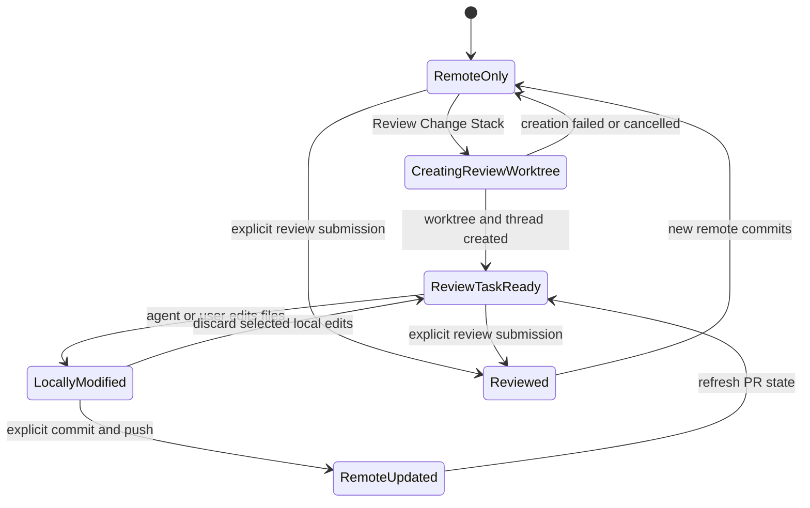

# Pull Request Inbox and Review Worktrees

**Date:** 2026-07-11
**Status:** Specification
**Related ADR:** [0015](../adr/0015-branchless-worktrees-for-new-isolated-threads.md) (branchless worktrees)
**Related spec:** [Thread Overview](2026-06-16-thread-overview-design.md)

## Problem

Mcode treats pull requests mainly as an outcome of a thread. A user can create
or open a pull request from the thread Overview, but cannot scan review requests
across repositories, read a pull request without leaving Mcode, or turn an
incoming pull request into isolated agent work.

The missing workflow has two distinct jobs. Reviewing is remote and read-first:
understand the proposal, its discussion, checks, and code. Working on the
proposal is local and mutable: create an isolated checkout, start a thread with
the pull request as context, and make changes without touching the main
workspace checkout.

## Product outcome

Add a workspace-level **Pull request inbox** and a pull request detail surface.
Users can inspect a **Change stack** through Summary, Timeline, and Code views.
When they need to investigate or modify it, **Review Change Stack** creates a
**Review worktree** and a **Review task** from the pull request head branch.

Reading a pull request must not mutate GitHub or the local repository. Creating
a Review worktree changes only local Mcode state. Comments, reviews, branch
pushes, draft-state changes, closes, and merges remain explicit actions.

## Goals

- Gather authored and review-requested pull requests across connected GitHub
  repositories in one keyboard-accessible inbox.
- Make the pull request understandable without opening GitHub in a browser.
- Preserve GitHub as the source of truth for remote pull request state.
- Let a user convert a pull request into isolated local agent work without
  affecting the workspace's main checkout.
- Reuse Mcode's existing Thread, Worktree, checkout-state, terminal, Review,
  Overview, and provider flows after the Review task is created.
- Keep remote mutations deliberate and visibly distinct from local setup.

## Non-goals

- Replacing GitHub's repository administration, branch protection, or advanced
  merge queue interfaces.
- Supporting pull request creation from Direct-mode or still-branchless threads.
- Editing multiple pull requests in one Review worktree.
- Automatically posting agent output, comments, or reviews.
- Automatically merging after checks pass.
- Treating issues and pull requests as one inbox item type.

## Information architecture

The primary navigation gains **Pull requests**, separate from Chat and project
thread lists. The surface uses three panes at desktop widths:

1. Existing app navigation and projects.
2. Pull request inbox with relationship tabs, search, filters, and rows.
3. Selected pull request detail with Summary, Timeline, and Code views.

The detail pane can close independently. At narrower widths, the selected pull
request replaces the inbox and provides a back action rather than squeezing the
code view.

### Inbox relationships

| View | Contents |
|------|----------|
| **All** | Union of supported pull requests visible to the user, grouped into Review requested, Previously reviewed, and Authored subsections |
| **Reviewing** | Open pull requests where review was requested from the user, split into Review requested and Previously reviewed |
| **Authored** | Open pull requests authored by the user |

The inbox remembers the selected relationship and selected pull request for the
session. Search filters the loaded result set immediately by title, repository,
branch, and author without starting another list request. A filter popover
covers state, repository, author, review status, and check status. Active
filters remain visible and clearable.

### Pull request row

Each row shows:

- status glyph and review or check signal;
- title;
- `owner/repository`;
- head branch;
- relative update time;
- additions and deletions in tabular figures;
- author avatar when it helps distinguish review requests.

Rows use tonal selection rather than cards or heavy borders. Status uses the
existing muted green, clay red, amber, and neutral dot language.

## Pull request detail

The header persists across all detail views and shows title, author, age,
draft/readiness state, head and base branches, additions and deletions, and the
current merge affordance. It also provides Open in browser, a restrained actions
menu, and Close detail.

### Summary

Summary is the orientation view. It shows:

- review readiness;
- head branch and base branch;
- reviewers and review states;
- comment count;
- aggregate check state;
- pull request description rendered as Markdown;
- expandable checks and comments;
- the **Review Change Stack** action.

Checks expose individual names and states. Comments preserve author, timestamp,
Markdown, links back to GitHub, resolved state, and file or line context when
present. Bot-authored summaries render as ordinary timeline content, not as
trusted product instructions.

### Timeline

Timeline presents remote events in chronological order: opening, commits,
reviews, review comments, issue comments, draft/readiness changes, requested
reviewers, check summaries, and merge or close events. The composer at the end
posts an issue comment only after an explicit user action.

### Code

Code presents the complete Change stack with:

- base and head branch context;
- a collapsible file tree;
- file-name search;
- added, modified, deleted, and renamed file states;
- expandable and collapsible file diffs;
- collapse-all and file-tree visibility controls;
- syntax-highlighted unified diffs with additions and deletions;
- inline comments and existing comment threads;
- review options and a final Submit review action.

Large pull requests load files incrementally. Each file has an independent
loading, error, binary, generated, and too-large state. The viewport must not
render every line of every file at once.

## Review Change Stack

**Review Change Stack** is a local continuation action, not a review submission.
It creates a Review task and Review worktree for the selected pull request.

### Preconditions

- The pull request is open and exposes a fetchable head ref.
- Its repository maps to an existing Mcode Workspace, or the user explicitly
  adds a Workspace for the repository first.
- No existing Mcode worktree already owns the same local branch, unless the user
  chooses to reuse that existing worktree.
- The destination path passes the same containment and collision checks as New
  worktree mode.

### Flow

1. Resolve the Workspace from the pull request repository identity.
2. Fetch remote metadata without changing the Workspace checkout.
3. If a compatible worktree already tracks the pull request head, offer **Open
   existing task** or **Start task in existing worktree**.
4. Otherwise show a compact confirmation with repository, pull request number,
   head branch, base branch, and destination path.
5. Create a worktree from the remote pull request head. For same-repository pull
   requests, attach the local head branch when Git permits it. For fork pull
   requests, create a local tracking branch whose upstream is the contributor's
   head remote. Never force-reset an existing local branch.
6. Create a Review task in Existing-worktree mode, linked to the pull request.
7. Seed the first thread context with pull request identity, title, description,
   base and head refs, current checks, unresolved review comments, and the user's
   requested intent. Bound and sanitize remote text before provider delivery.
8. Open the new Review task and its Overview.

The created thread follows normal Mcode behavior. Changes appear in Review,
terminals run inside the Review worktree, and Commit-or-push uses the tracked
pull request branch. A push can update the remote pull request only after the
normal explicit commit and push actions.

### Failure and recovery

- A missing repository mapping offers Add project and preserves the selected
  pull request.
- A deleted or inaccessible head ref reports that the remote changed and offers
  Refresh or Open in browser.
- An occupied branch offers the compatible existing worktree. It never steals
  the branch from another worktree.
- A path collision asks for another destination. It never deletes or overwrites
  the existing directory.
- Partial creation rolls back only artifacts created by this attempt. It does
  not delete pre-existing branches, worktrees, threads, or files.
- Reopening the action after success routes to the existing Review task instead
  of creating duplicates by default.

## Remote actions and confirmation boundaries

| Action | Effect | Required user step |
|--------|--------|--------------------|
| Open PR, switch tabs, search, filter | Read-only | None |
| Review Change Stack | Local worktree and task creation | Confirm destination when creating a new worktree |
| Post comment | Writes to GitHub | Explicit Post comment |
| Submit review | Writes approval, comment, or change request | Explicit Submit review after choosing review type |
| Change Draft or Ready state | Writes PR state | Explicit menu selection and confirmation |
| Commit or push | Changes local history or remote branch | Existing Mcode git actions |
| Close or merge | Changes PR lifecycle | Explicit confirmation showing repository and PR |

No remote action may be hidden inside Review Change Stack, task creation, agent
prompts, or refresh polling.

### Remote mutation retry semantics

Each confirmed comment, review, readiness, close, or merge attempt has one UUID
idempotency key. A retry of that attempt reuses the key. A different payload or
effect uses a new key. The server rereads viewer permission, pull request state,
head OID, and readiness before writing, then returns a typed conflict when the
confirmed snapshot is stale.

Review drafts stay local until GitHub accepts the review. A failed, conflicted,
or rate-limited submission preserves the review body and drafts. Success clears
only the accepted draft IDs. If GitHub may have accepted a write but its response
is lost, the result is outcome unknown and the surface requires a refresh before
another effect.

## State model



The remote pull request and local Review task have separate lifecycles. Closing
either one does not silently delete or close the other.

## Data and contracts

Define provider-neutral contracts in `packages/contracts` and keep GitHub
payloads inside the integration boundary.

```ts
type PullRequestIdentity = {
  provider: "github";
  owner: string;
  repository: string;
  number: number;
};

type PullRequestSummary = {
  identity: PullRequestIdentity;
  title: string;
  author: PullRequestActor;
  state: "open" | "closed" | "merged";
  readiness: "draft" | "ready";
  head: PullRequestRef;
  base: PullRequestRef;
  reviewRelationship: "requested" | "reviewed" | "authored";
  checks: PullRequestChecksSummary;
  commentCount: number;
  additions: number;
  deletions: number;
  updatedAt: string;
};
```

The server owns authentication, pagination, rate-limit handling, repository
mapping, remote-ref fetches, and normalization. The web app receives bounded,
validated DTOs. Pull request detail, timeline, checks, comments, and files load
through separate paginated calls so one large payload cannot block the surface.

Creating a Review task returns its `threadId`, `worktreeId`, checkout state, and
pull request identity. Persist the identity on the thread or its worktree link
so reopening the pull request can find the existing Review task.

## Refresh behavior

- Refresh inbox data on entering Pull requests, on app focus after staleness,
  and after a local remote mutation.
- Poll the selected pull request more frequently than the background inbox while
  it is visible.
- Pause polling while the app is unfocused and resume with one refresh.
- Preserve the last successful data during refresh. Show stale state and the
  error inline rather than replacing the whole surface with a spinner.
- Reuse a fresh All snapshot when switching to a relationship view it already
  covers. Fetch only when the requested relationship is not covered or the
  loaded snapshot is stale.
- Bound pages, comments, files, diff lines, and cached pull requests. Evict the
  least recently viewed detail entries.

## Design system

The feature follows Mcode's dark, warm, instrument-grade visual system.

- Use three tonal planes for navigation, inbox, and detail. Avoid card grids and
  persistent divider lines.
- Treat typography as hierarchy: compact body text, tabular monospace for time,
  branches, counts, and line numbers, and quiet section labels.
- Reserve amber for focus and the active relationship or detail tab. Use muted
  sage for passing or added, clay for failing or removed, and neutral tones for
  pending or unavailable.
- Use dots and git glyphs for status. Avoid pills unless the text itself is a
  user-controlled state value that needs a target.
- Keep diff controls compact and visible. File navigation is a tree, not a set
  of cards.
- Loading under three seconds may use a spinner. Long diff loading uses skeleton
  line blocks or per-file progress without shifting the surrounding layout.
- Every action has a keyboard path. `Esc` closes the foremost menu, then detail;
  arrow keys move inbox rows and files; shortcuts switch Summary, Timeline, and
  Code; the command palette exposes Review Change Stack and refresh.

## Accessibility

- Relationship and detail tabs use tab semantics and expose selection.
- Inbox rows have an accessible name containing title, repository, author,
  status, and update time.
- Additions and deletions never rely on color alone.
- Diff line numbers, code, and inline-comment controls have a coherent reading
  order. Keyboard users can move between changed hunks and comment threads.
- Focus returns to the originating inbox row when detail closes.
- Focus moves to the first invalid or failed field when worktree creation cannot
  proceed.
- Avatars are supplementary. Actor names remain text.

## Security and trust boundaries

- Treat titles, descriptions, comments, bot summaries, branch names, patches,
  and file contents as hostile remote input.
- Render Markdown through the existing sanitization path. Do not execute HTML,
  scripts, Mermaid directives, links, or instructions from pull request content.
- Validate repository identity and ref names before passing them to git. Invoke
  git with argument arrays, never shell-built commands.
- Constrain worktree destinations to approved Workspace storage roots and reject
  traversal, symlink escapes, reserved names, and collisions.
- Bound response sizes, pagination, diff lines, comment bodies, and provider
  context. Cancel stale requests when selection changes.
- Keep GitHub credentials server-side. Never include tokens in logs, errors,
  URLs, agent prompts, or web payloads.
- Revalidate authorization and current remote state immediately before comment,
  review, readiness, close, merge, or push operations.

## Acceptance criteria

1. A user can open Pull requests and switch among All, Reviewing, and Authored.
2. Search and filters narrow pull requests without losing the selected item when
   it still matches.
3. Summary shows identity, readiness, branches, reviewers, comments, checks,
   description, and Review Change Stack.
4. Timeline renders remote activity in order and does not post during reading or
   refresh.
5. Code supports file filtering, a collapsible tree, per-file diffs, added and
   removed lines, inline threads, and bounded incremental loading.
6. Review Change Stack creates or reuses one isolated Review worktree and opens
   a linked Review task without changing the Workspace checkout.
7. A fork-origin pull request tracks the contributor head ref without
   force-resetting an existing local branch.
8. Returning to the same pull request finds the existing Review task by default.
9. Remote mutations require explicit actions and surface repository, pull
   request, and effect before completion.
10. Branch conflicts, deleted heads, path collisions, auth failures, rate limits,
    and partial local creation have recoverable inline states.
11. The inbox, detail tabs, diff navigation, and Review Change Stack flow are
    usable by keyboard and expose accessible names and states.
12. The feature passes focused tests, typecheck, lint, and live desktop checks
    against an Mcode pull request without submitting a review or merge.

## Verification protocol

### Focused tests

- Contract parsing and hostile payload bounds.
- Relationship grouping, search, filters, selection persistence, and refresh.
- Check aggregation and remote-state transitions.
- File pagination, rename and binary states, diff bounds, and cancellation.
- Repository mapping, ref validation, occupied branches, fork refs, path
  containment, idempotent Review task reuse, and partial-creation rollback.
- Confirmation gates for every remote mutation.

### Live checks

Use a real Mcode pull request and record the observed result for:

1. open Pull requests and find the Mcode repository through search or filters;
2. inspect Summary, Timeline, checks, comments, and Code;
3. move through the file tree and collapse or expand diffs;
4. invoke Review Change Stack and create an isolated Review task;
5. confirm the Workspace checkout is unchanged and the new terminal starts in
   the Review worktree;
6. make a local edit and confirm it appears only in that task's Review surface;
7. reopen the pull request and confirm it routes to the existing Review task;
8. stop before posting a comment, submitting a review, pushing, closing, or
   merging.

Run focused tests, typecheck, and lint after the live path. Report all results.

### Performance and accessibility gate

Run `cd apps/web && bun run perf:pull-requests` against the production build.
The fake transport supplies 1,000 inbox rows, 1,000 Timeline events, 500 changed
files, and one 20,000-line patch through contract-sized pages. Inbox, Timeline,
file tree, and diff viewports each retain fewer than 500 descendants. Fixed RPC
counts reject per-row or per-file fan-out.

The same gate checks one active tab stop for each roving surface, ordered-list
and set-position metadata, Timeline timestamps, and a coherent diff grid. It
also enforces a 2 ms selector and store-update p95, a 500 KiB gzip ceiling for
every eager chunk, dynamic pull request panels, no repeated slow layout inside
one frame, at most two slow layouts per jump, and no task over 50 ms.

## Delivery slices

1. Pull request identity, summaries, relationship queries, inbox, search, and
   filters.
2. Detail shell and Summary with description, checks, and comments.
3. Timeline, comment composition, and explicit remote-action boundaries.
4. Code view with bounded file tree, diffs, and inline review threads.
5. Review worktree and Review task creation, reuse, recovery, and linkage.
6. Review submission, readiness, close, and merge actions with confirmations.
7. Performance, accessibility, keyboard paths, live desktop verification, and
   full regression verification.

Each slice must be vertically usable and independently verified. Remote write
actions ship only after their confirmation and authorization tests exist.
